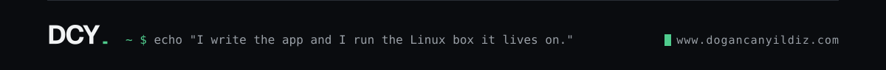

<!--
  Profile README for github.com/dogancanyildiz
  Same visual system as www.dogancanyildiz.com: Geist type, hairline rules,
  one green (#4fcc8d dark / #007041 light) on an onyx or off-white ground.
  Hero, divider and footer are hand written SVGs under assets/ (animated with
  SMIL, fonts embedded, no external requests). Stats cards are refreshed daily
  by .github/workflows/stats-cards.yml, the post list by blog-posts.yml.
-->

<picture>
  <source media="(prefers-color-scheme: dark)" srcset="./assets/hero-dark.svg" />
  <source media="(prefers-color-scheme: light)" srcset="./assets/hero-light.svg" />
  
</picture>

  
  
  
  
  
  

  
  
  

## About

I write web applications and I run the Linux servers they live on. Full Stack developer at **BerrSoft** since November 2024, where I have shipped five production applications on my own, from the first architecture call to the bug that turns up after launch. Studying Mathematics and Computer Science at Necmettin Erbakan University alongside the job.

Networking and security are part of how I build, not a product I sell: I test my own code, and what a penetration test turned up on the ticketing app went straight back into input validation, session handling and a non-root container.

| | |
|:--|:--|
| **Now** | Full Stack at BerrSoft · taking on corporate websites and Next.js applications as freelance work |
| **Stack** | Next.js · React · Node.js · Express · PostgreSQL · MongoDB · Docker · Coolify · Traefik · Cloudflare · Linux |
| **Also** | C# / ASP.NET MVC · PHP · GitHub Actions · Cisco networking (CCNA track) · CAPT |
| **Community** | GDG Konya organizer for two years, GDG Cloud Konya core team |
| **Contact** | [me@dogancanyildiz.com](mailto:me@dogancanyildiz.com) · [WhatsApp](https://wa.me/905318739400) |

<picture>
  <source media="(prefers-color-scheme: dark)" srcset="./assets/divider-dark.svg" />
  <source media="(prefers-color-scheme: light)" srcset="./assets/divider-light.svg" />
  
</picture>

## Stack

  <picture>
    <source media="(prefers-color-scheme: dark)" srcset="https://skillicons.dev/icons?i=ts%2Cnextjs%2Creact%2Cnodejs%2Cexpress%2Ctailwind%2Cpostgres%2Cmongodb%2Cdocker%2Clinux%2Cgithubactions%2Ccloudflare%2Cgit%2Ccs%2Cdotnet%2Cphp&theme=dark&perline=8" />
    <source media="(prefers-color-scheme: light)" srcset="https://skillicons.dev/icons?i=ts%2Cnextjs%2Creact%2Cnodejs%2Cexpress%2Ctailwind%2Cpostgres%2Cmongodb%2Cdocker%2Clinux%2Cgithubactions%2Ccloudflare%2Cgit%2Ccs%2Cdotnet%2Cphp&theme=light&perline=8" />
    
  </picture>

<code>Coolify</code> · <code>Traefik</code> · <code>Hetzner</code> · <code>Uptime Kuma</code> · <code>Umami</code> · <code>Mailcow</code> · <code>Velite MDX</code> · <code>Vitest</code>

## Selected work

The site itself is the reference project: Next.js 16 App Router, Turkish and English, Docker image built by GitHub Actions and deployed to my own Hetzner box through Coolify behind Traefik and Cloudflare. Every decision is written down in the repo's `docs/`.

  <a href="https://github.com/dogancanyildiz/dogancanyildiz.com">
    <picture>
      <source media="(prefers-color-scheme: dark)" srcset="./assets/stats/pin-dogancanyildiz.com-dark.svg" />
      <source media="(prefers-color-scheme: light)" srcset="./assets/stats/pin-dogancanyildiz.com-light.svg" />
      
    </picture>
  </a>
  <a href="https://github.com/dogancanyildiz/wikonya">
    <picture>
      <source media="(prefers-color-scheme: dark)" srcset="./assets/stats/pin-wikonya-dark.svg" />
      <source media="(prefers-color-scheme: light)" srcset="./assets/stats/pin-wikonya-light.svg" />
      
    </picture>
  </a>

  <a href="https://github.com/dogancanyildiz/bilet-satin-alma">
    <picture>
      <source media="(prefers-color-scheme: dark)" srcset="./assets/stats/pin-bilet-satin-alma-dark.svg" />
      <source media="(prefers-color-scheme: light)" srcset="./assets/stats/pin-bilet-satin-alma-light.svg" />
      
    </picture>
  </a>
  <a href="https://github.com/dogancanyildiz/gpa">
    <picture>
      <source media="(prefers-color-scheme: dark)" srcset="./assets/stats/pin-gpa-dark.svg" />
      <source media="(prefers-color-scheme: light)" srcset="./assets/stats/pin-gpa-light.svg" />
      
    </picture>
  </a>

| Project | What it is | Links |
|:--|:--|:--|
| **Köklü Hukuk** | Law firm website: Next.js, self-hosted, delivered end to end | [live](https://www.kokluhukuk.com) · [case study](https://www.dogancanyildiz.com/en/projects/koklu-hukuk) |
| **Cargo Pilot** | Logistics operations app for a Divizyon team | [live](https://cargopilot.divizyon.org) · [case study](https://www.dogancanyildiz.com/en/projects/cargo-pilot) |
| **Wikonya** | A living knowledge base built by university students in Konya | [live](https://wikonya.vercel.app) · [repo](https://github.com/dogancanyildiz/wikonya) |
| **Ticket purchasing system** | PHP, SQLite and Docker; the app I later penetration tested and hardened | [repo](https://github.com/dogancanyildiz/bilet-satin-alma) · [case study](https://www.dogancanyildiz.com/en/projects/ticket-purchasing-system) |

All six case studies: [dogancanyildiz.com/en/projects](https://www.dogancanyildiz.com/en/projects)

<picture>
  <source media="(prefers-color-scheme: dark)" srcset="./assets/divider-dark.svg" />
  <source media="(prefers-color-scheme: light)" srcset="./assets/divider-light.svg" />
  
</picture>

## Writing

Notes from running real things: Docker images, client IPs behind Cloudflare and Traefik, self-hosting with Coolify, a CAPT prep lab. Turkish originals with English editions.

<!-- BLOG-POST-LIST:START -->
- [Running Next.js in Docker with multi-stage builds and a non-root user](https://www.dogancanyildiz.com/en/blog/nextjs-docker-multi-stage-non-root) · Sep 3, 2026
- [Reading the real client IP behind Cloudflare and Traefik](https://www.dogancanyildiz.com/en/blog/reading-the-real-client-ip) · Sep 3, 2026
- [How this site ships to my own server with Coolify](https://www.dogancanyildiz.com/en/blog/self-hosting-with-coolify) · Aug 20, 2026
- [Most of my CAPT preparation happened in a Docker lab](https://www.dogancanyildiz.com/en/blog/capt-preparation-in-a-docker-lab) · Jul 15, 2026<!-- BLOG-POST-LIST:END -->

More at [dogancanyildiz.com/en/blog](https://www.dogancanyildiz.com/en/blog) · [RSS](https://www.dogancanyildiz.com/en/feed.xml)

<picture>
  <source media="(prefers-color-scheme: dark)" srcset="./assets/divider-dark.svg" />
  <source media="(prefers-color-scheme: light)" srcset="./assets/divider-light.svg" />
  
</picture>

## GitHub

  <picture>
    <source media="(prefers-color-scheme: dark)" srcset="./assets/stats/stats-dark.svg" />
    <source media="(prefers-color-scheme: light)" srcset="./assets/stats/stats-light.svg" />
    
  </picture>
  <picture>
    <source media="(prefers-color-scheme: dark)" srcset="https://streak-stats.demolab.com?user=dogancanyildiz&hide_border=true&background=0a0c0f&ring=4fcc8d&fire=4fcc8d&currStreakLabel=4fcc8d&sideLabels=999fa6&dates=999fa6&currStreakNum=f1f3f4&sideNums=f1f3f4&stroke=2a2f36" />
    <source media="(prefers-color-scheme: light)" srcset="https://streak-stats.demolab.com?user=dogancanyildiz&hide_border=true&background=f9fafb&ring=007041&fire=007041&currStreakLabel=007041&sideLabels=6b7280&dates=6b7280&currStreakNum=1f2428&sideNums=1f2428&stroke=d5d9de" />
    
  </picture>

  <picture>
    <source media="(prefers-color-scheme: dark)" srcset="./assets/stats/top-langs-dark.svg" />
    <source media="(prefers-color-scheme: light)" srcset="./assets/stats/top-langs-light.svg" />
    
  </picture>

  <picture>
    <source media="(prefers-color-scheme: dark)" srcset="./assets/snake/github-contribution-grid-snake-dark.svg" />
    <source media="(prefers-color-scheme: light)" srcset="./assets/snake/github-contribution-grid-snake.svg" />
    
  </picture>

<picture>
  <source media="(prefers-color-scheme: dark)" srcset="./assets/footer-dark.svg" />
  <source media="(prefers-color-scheme: light)" srcset="./assets/footer-light.svg" />
  
</picture>
