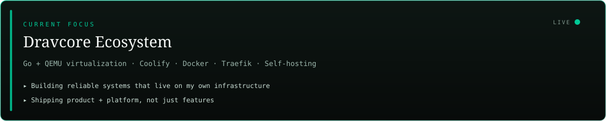
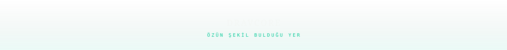

<!--
  Premium GitHub profile README
  Visual system: custom SVG assets + skillicons + transparent stats
  Brand: Dravcore teal (#00C896) on onyx
-->

  

  

  
  
  
  
  
  

  
  
  
  

  

## About

I'm **Doğan Can Yıldız** — a full-stack developer and DevOps enthusiast based in Ankara.  
I study **Mathematics & Computer Science** at [Necmettin Erbakan University](https://www.erbakan.edu.tr/), and I treat software as a path **from essence to order**.

I don't just ship apps. I design the systems they run on: containers, reverse proxies, self-hosted platforms, and infrastructure that stays observable under load.

Currently building **[Dravcore](https://dravcore.com)** — virtualization, self-hosted services, and developer tooling as one ecosystem.

| | |
|:--|:--|
| **Company** | BerrSoft Bilgi Teknolojileri |
| **Focus** | Full-Stack · DevOps · Self-Hosting |
| **Stack core** | Go · TypeScript · Docker · Coolify · Traefik |
| **Contact** | [me@dogancanyildiz.com](mailto:me@dogancanyildiz.com) |

  

## Now

  

| Track | What I'm doing |
|:------|:---------------|
| **Platform** | Go + QEMU based virtualization & self-hosted ops |
| **Product** | Wikonya · MindCore · student-facing web/mobile apps |
| **Craft** | Coolify · Docker · Traefik · Linux server engineering |
| **Theory** | Linear algebra · probability · combinatorics → systems thinking |

  

## Tech Stack

  

  <code>Go</code> ·
  <code>TypeScript</code> ·
  <code>NestJS</code> ·
  <code>Next.js</code> ·
  <code>React Native</code> ·
  <code>PostgreSQL</code> ·
  <code>Docker</code> ·
  <code>Traefik</code> ·
  <code>Coolify</code> ·
  <code>QEMU</code> ·
  <code>Linux</code>

  

## Selected Work

### Dravcore Ecosystem

| Project | Role | Stack |
|:--------|:-----|:------|
| **Dravcore Virtualization** | Go + QEMU VM manager for self-hosted compute | Go · QEMU · Linux |
| **MindCore App** | End-to-end mobile product with API & data layer | React Native · NestJS · PostgreSQL |
| **[Wikonya](https://github.com/dogancanyildiz/wikonya)** | Collective knowledge universe for university students in Konya | TypeScript · [Live](https://wikonya.vercel.app) |

### Public Repositories

  
  

  
  

<b>More projects</b>

 

| Repo | Notes |
|:-----|:------|
| [**gpa**](https://github.com/dogancanyildiz/gpa) | Grade calculator + GPA tracker — [demo](https://dogancanyildiz.github.io/gpa/) |
| [**bilet-satin-alma**](https://github.com/dogancanyildiz/bilet-satin-alma) | PHP · SQLite · Docker ticket system |
| [**gowebscraper**](https://github.com/dogancanyildiz/gowebscraper) / [**torgowebscraper**](https://github.com/dogancanyildiz/torgowebscraper) | Go scraping experiments |
| [**RoguelikeGame**](https://github.com/dogancanyildiz/RoguelikeGame) | Python roguelike prototype |

  

## GitHub Signals

  
  

  

  

## Activity

  

  <picture>
    <source media="(prefers-color-scheme: dark)" srcset="./assets/snake/github-contribution-grid-snake-dark.svg" />
    <source media="(prefers-color-scheme: light)" srcset="./assets/snake/github-contribution-grid-snake.svg" />
    
  </picture>

  

## Working Style

- **Self-hosting first** — prefer owning the runtime, not renting the black box  
- **Math → engineering** — abstract models become reliable systems  
- **Product + platform** — features mean little without deployable infrastructure  
- **Quiet craft** — clean interfaces, observable ops, long-lived architecture  

## Collaborate

Open to collaboration on **self-hosting**, **full-stack products**, **DevOps automation**, and **student-focused platforms**.

  
  
  

  

